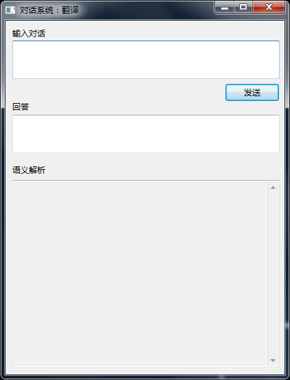
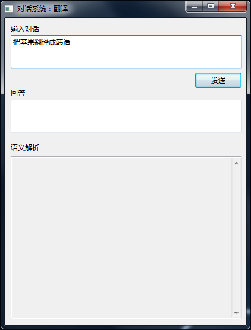
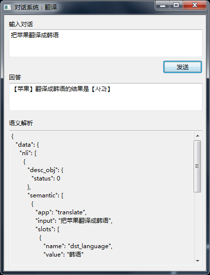

##TranslateDemo说明文档
TranslateDemo.jar可以直接运行、而且有可视化界面。 
界面中有 **对话输入框、回答框、语义解析框。** 

 

在 **对话输入框** 输入对话或者要测试的语句，点击 **发送** 按钮，接下来就会在 **语义解析框** 中显示输入内容的语义，**回答框** 中显示处理的结果。 

  

开发者可以通过自己的账号来更改所支持的内容，目前本Demo只支持关于翻译的相关语句。 

##关于开发
TranslateDemo的源代码只是做示例展示，仅供参考。 

源代码说明： 
>**MainWindow.java** 是主程序，做的是窗口的建立和主流程的控制； 
>**GetModifier.java** 功能是从OLAMI提供的API接口拿到语义； 
>**ModifierProcess.java** 功能是处理语义； 
>**TranslateByAPI.java** 功能是从翻译API接口拿到翻译的结果； 
>**Encrypt.java** 功能是加密字符串，里面只有MD5加密的方法； 
>**Format.java** 功能是整理JSON内容，用于输出； 
>**HttpRequestUtils.java** 功能是发送HTTP请求,获得HTTP返回的数据； 
>**ApiLanguage.java** 里面是翻译API接口需要的各国语言的缩写 
>**NLPJSON.java** 里面是拿到语义返回JSON数据的关键字。 
>**APIJSON.java** 里面是拿到翻译返回JSON数据的关键字； 

##重要补充
>TranslateDemo中的 **GetModifier.java** 里面所使用到的调用语义API接口的关键信息，开发者需自行在[OLAMI官网](http://cn.olami.ai)注册生成并更换，这样开发者可以自己定义所需的语法。 
>**TranslateByAPI.java** 里所使用到的调用翻译API接口的关键信息，开发者也需自行更换。如果发现有被乱用的现象，作者将关闭翻译API的接口。 

<em>开发者可以登陆[OLAMI官网](http://cn.olami.ai)以及[OLAMI在线文档](http://cn.olami.ai/wiki/)了解更多。 </em>